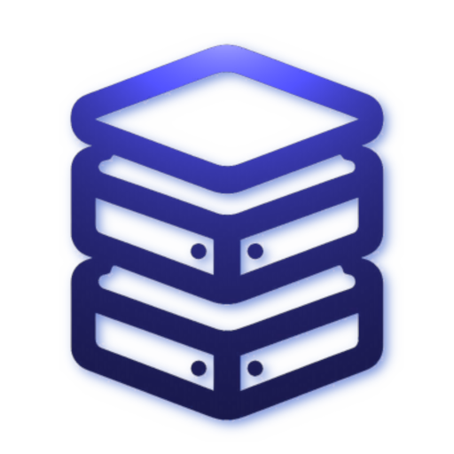

<p align="center">
  
</p>

<h1 align="center">  Toocal </h1>
<p align="center">
    <em> Minimalist nosql database system (WIP) </em>
</p>

```c++
auto dal = Data_access_layer{"db.db", {page::Page::DEFAULT_PAGE_SIZE, 0.0125, 0.025}};

const auto collection_name = std::string{"collection1"};
auto            collection = Collection{
  &dal,
  std::vector<uint8_t>{collection_name.begin(), collection_name.end()},
  dal.meta.root};

for (uint32_t i = 1; i <= 6; i++)
  {
      const auto key = fmt::format("Key{}", i);
      const auto value = fmt::format("Value{}", i);

    collection
      .put(
        std::vector<uint8_t>{key.begin(), key.end()},
        std::vector<uint8_t>{value.begin(), value.end()})
      .map_error([&](const auto && error) { return error.panic(); });
  }

const auto key1   = std::string{"Key1"};
const auto value1 = std::string{"Value1"};
collection.find(std::vector<uint8_t>{key1.begin(), key1.end()})
  .map([&](const auto && item) {
    CHECK_NE(item, tl::nullopt);
    CHECK_EQ(
      key1, std::string{item.value().key.begin(), item.value().key.end()});
    CHECK_EQ(
      value1,
      std::string{item.value().value.begin(), item.value().value.end()});
  })
  .map_error([&](const auto && error) { return error.panic(); });

dal.close();
std::filesystem::remove(dal.path);
```

## Build

This project is built with [xmake](https://xmake.io), but it also provides cmake and makefile files generated by xmake, which is convenient for some users who don't have xmake installed.

This project was developed using gcc 14.2.0 and clang 18.1.8. In theory, the compiler should support C++ 20.

- git clone or download this project source code.
- cd or cd after unzip
- `xmake build`
- `xmake test`

## Deps

- [endian: C++ library for conversion between big and little endian data representations.](https://github.com/steinwurf/endian)
- [optional: C++11/14/17 std::optional with functional-style extensions and reference support](https://github.com/TartanLlama/optional)
- [expected: C++11/14/17 std::expected with functional-style extensions](https://github.com/TartanLlama/expected)
- [spdlog: Fast C++ logging library.](https://github.com/gabime/spdlog)

## About

### Page

The size of each page in toocal is the same as the operating system's virtual memory page size, but it also supports custom page size.

Page 0 and page 1 of toocal store the meta and freelist pages, which are used internally, so the real data will be stored starting from page 2.

### Serialization

toocal will serialize the internal data into files at a specific time, and all the data is in little endian order.

### Storage

toocal uses a balanced binary tree for storage, which will help reduce the number of disk accesses.

Each node in the tree is a key-value pair, and they are stored on disk using slotted pages technology, which is a layout for organizing key value pairs of different sizes by positioning fixed sized offsets at the beginning and the actual data itself at the end.

## [LICENSE](./LICENSE)

Copyright (c) 2024 Muqiu Han

All rights reserved.

Redistribution and use in source and binary forms, with or without modification,
are permitted provided that the following conditions are met:

    * Redistributions of source code must retain the above copyright notice,
      this list of conditions and the following disclaimer.
    * Redistributions in binary form must reproduce the above copyright notice,
      this list of conditions and the following disclaimer in the documentation
      and/or other materials provided with the distribution.
    * Neither the name of toocal nor the names of its contributors
      may be used to endorse or promote products derived from this software
      without specific prior written permission.

THIS SOFTWARE IS PROVIDED BY THE COPYRIGHT HOLDERS AND CONTRIBUTORS
"AS IS" AND ANY EXPRESS OR IMPLIED WARRANTIES, INCLUDING, BUT NOT
LIMITED TO, THE IMPLIED WARRANTIES OF MERCHANTABILITY AND FITNESS FOR
A PARTICULAR PURPOSE ARE DISCLAIMED. IN NO EVENT SHALL THE COPYRIGHT OWNER OR
CONTRIBUTORS BE LIABLE FOR ANY DIRECT, INDIRECT, INCIDENTAL, SPECIAL,
EXEMPLARY, OR CONSEQUENTIAL DAMAGES (INCLUDING, BUT NOT LIMITED TO,
PROCUREMENT OF SUBSTITUTE GOODS OR SERVICES; LOSS OF USE, DATA, OR
PROFITS; OR BUSINESS INTERRUPTION) HOWEVER CAUSED AND ON ANY THEORY OF
LIABILITY, WHETHER IN CONTRACT, STRICT LIABILITY, OR TORT (INCLUDING
NEGLIGENCE OR OTHERWISE) ARISING IN ANY WAY OUT OF THE USE OF THIS
SOFTWARE, EVEN IF ADVISED OF THE POSSIBILITY OF SUCH DAMAGE.
